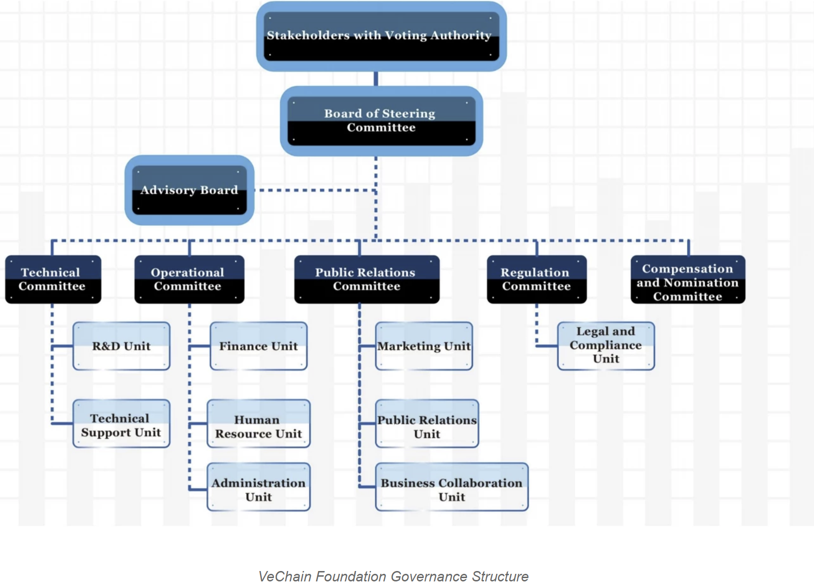
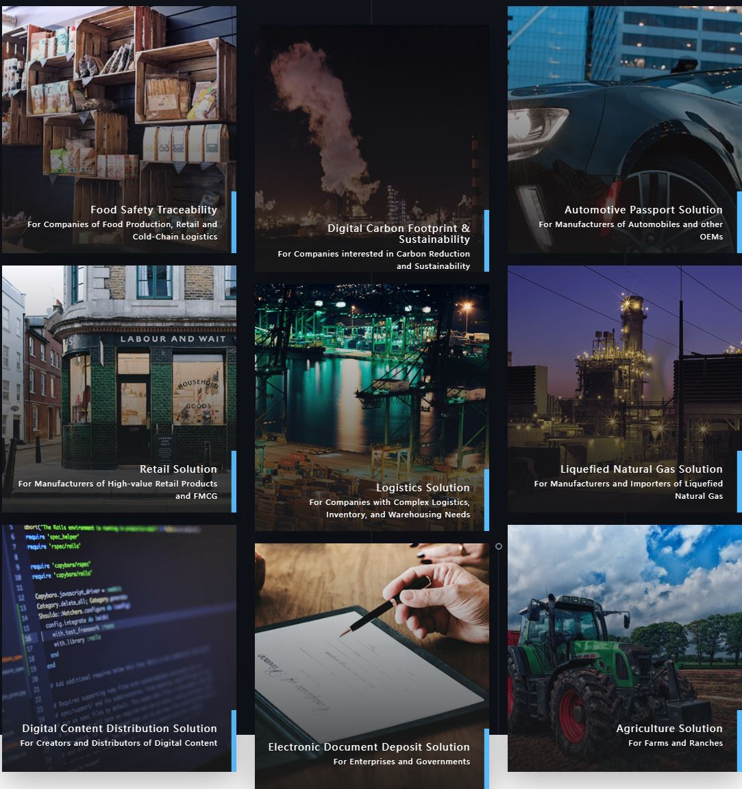

# VeChain - Supply Me  Some Blockchain

## Overview and Origin

### What is VeChain

* VeChain simply put, is a blockchain platform, "[designed to enhance supply chain management and business processes. Its goal is to streamline these processes and information flow for complex supply chains through the use of distributed ledger technology (DLT).](https://www.investopedia.com/terms/v/vechain.asp)", as stated within Investopedia.
* VeChain's whitepaper, notes the vision of the company as VeChain’s vision as, "lowering the barrier and enabling established business with blockchain technology to create value and solve real world economic problems."

* VeChain was founded in June 2015, in China, by Sunny Lu, current CEO, the former chief information officer (CIO) of Louis Vuitton China, and Jay Zhang, who previously had a role as a senior manager within Deloitte UK and PwC China.

* Sunny held jobs with [Netstar, 3M, Bacardi, and for Louis Vuitton China in 2010.](https://cryptoupclose.com/vechain-founder-sunny-lu/#:~:text=VeChain%20founder%20Sunny%20Lu%20is%20on%20a%20mission,listed%20as%20VET%20or%20VechainThor%20on%20crypto%20exchanges).

### Beginnings of VeChain
* VeChain’s development roots [can be traced](https://medium.com/vechain-foundation/special-feature-and-interview-with-vechain-ceo-sunny-lu-hosted-by-vechains-angel-investor-ee8a13e994b0) to the acquaintance of Sunny and Vitalik Buterin (Founder of the Ethereum Blockchain), through the Founder of Fenbushi Capital (one of VeChains early angel investors), Shen Bo in late 2015. The discussion between the two led to Sunny’s realization of the practicality of smart contract technology.

* Mr. Lu learned about blockchain technology in 2013 and in the same year, he [co-founded a company called BitSE](https://blockchain.capitalmarketsciooutlook.com/vendor/bitse-transforming-supply-chain-through-blockchain-cid-88-mid-17.html). BitSE created a subsidiary company, "VeChain", that lead to the creation of the VeChainThor blockchain. At the beginning of the venture, VeChain built its own permissioned blockchain based on the Ethereum network as a token. Later on, moving away from the Ethereum network, Vechain migrated to their own architecture and ecosystem.

### VeChain's Funding and Key Persons

## Team Members

* Below are the [key members](https://www.vechain.com/about) of the VeChain organization and brief background on each member, highlighting the expertise that VeChains founding members brought together to build out the VeChain enterprise:
  * Sunny Lu - Chief Executive Officer
      * Cofounder of the VeChain blockchain.  20 years experience as an IT executive. Launched the VeChain project in 2015, founded VeChain in early 2017. 
  * Jay Zhang - Chief Financial Officer
      * Cofounder of the VeChain blockchain. 15 years experience as senior manager in finance and risk management for PwC China, and Deloitte UK.  Currently in charge of VeChain's global corporate structure, governance, and financial management.
  * Jianliang Gu - Chief Technology Officer 
      * 16 years experience in both hardware and software embedded system development and IT management. Joining VeChain in 2017, he is in charge of tech development, enterprise blockchain solutions, and IoT technologies.
  * Dr. Peter Zhou - Chief Scientist of Research & Development
      * 10 years experience in computer science research and development, with strong research background in blockchain, machine learning, and data analysis. He oversees the intellectual property protection.
  * Bin Qian - Chief Blockchain Architect
      * 10 years experience in mobile application development, Bin leads the architecture design, development, and iteration of VeChain blockchain infrastructure, building user-friend tools for developers.
  * Yvette Xia - Chief Marketing Officer
      * Yvette oversees VeChain’s global marketing and communications in the enterprise blockchain space.
  * Yanyu Chen - VP of Operations
     * 20 years of management experience in developing technology industries.  Focusing in cross-organisational and cross-cultural management.
  * Scott Brisbin - General Counsel
     * 32 years experience, currently General Counsel since 2016, responsible for corporate legal matters, organization structure, and intellectual property protection.
  * Jerome Grilleres - General Manager, VeChain Europe
     * 8 years experience, joining VeChain in 2017, Jerome is in charge of VeChain's business development for the whole Europe market.
  * Jason Rockwood - Country Manager, VeChain US
     * 9 years experience in IT strategy, digital customer experience design, application development, and digital transformation. Extensive experience in IT services and management, in charge of the business development for the North America market.
  * Arnaud Bauer - Ecosystem Manager, VeChain Europe
    * 5 years experience in IT system implementation and management, Arnaud works with VeChain's business partners such as DNV in Europe to facilitate the adoption of blockchain solutions co-developed by VeChain and its partners.
  * Dimitrios Neocleous - Ecosystem Manager, VeChain Europe
    * Joined VeChain in January 2019, he facilitates the adoption of VeChain enterprise solutions in Europe and supplements his legal expertise in VeChain's collaboration with national governments in Europe.

## Business Structure
 

* While undisclosed from multiple sources, Vechain has [recieved funding over 3 rounds](https://www.crunchbase.com/organization/vechain/investor_financials). Their latest funding was raised on May 5, 2018 from a Corporate Round round. Vechain is funded by 5 investors. DNV GL and PwC are the most recent investors.
* At the beginning, while VeChain was exploring the blockchain application scenarios and industry, partners were introduced to the executive team, in which [Fenbushi Capital, one of the first blockchain venture capital firms in Asia](https://www.fenbushicapital.vc/index_en.html), was one of the first partners looking into VeChain's offering, and ultimately becoming an angel investor. After that, [DNV and PwC also saw the potential in VeChain’s business model](https://medium.com/vechain-foundation/special-feature-and-interview-with-vechain-ceo-sunny-lu-hosted-by-vechains-angel-investor-ee8a13e994b0) and recognized Sunny and his team in the process of cooperation, and upgraded their involvement from partners to investors.

### Protocols

## What's a Protocol?
* A protocol [is a set of rules that governs the transfer of data between two or more electronic devices](https://medium.com/@genesishack/draft-what-are-blockchain-protocols-and-how-do-they-work-94815be5efa7).  Protocols on our devices are running behind the scenes for the everyday interneting that is now common place.  Protocols establish how information must be structured and how parties will send and recieve information.

* Some examples of familiar internet protocols are:
  *  TCP/IP
  *   HTTPS
  *   DNS

* The protocols above are the underlying code that allows all Internet applications to run. Facebook, Amazon, Twitter, Google, Netflix, banking websites, news websites commonly used in our everyday lives run on one of these internet protocols.

## Blockchain Protocols
* Like the internet, cryptocurrencies also [have their own protocols](https://blog.liquid.com/what-are-protocols-and-why-are-they-important).  Cryptocurrency protocols allow users to manage their data. They allow individuals, or businesses alike to create an account, or a wallet, on a protocol that can then be used to pay for services and make transact on other websites.

## VeChains Protocol - Proof of Authority (PoA) & Multi Party Payment (MPP)
* [The VeChainThor blockchain uses Proof of Authority as a consensus protocol](https://www.investopedia.com/terms/v/vechain.asp). There are 101 master nodes responsible for reaching consensus on transactions in VeChain’s blockchain. This differs from Bitcoin, which requires all nodes to vote on a transaction before reaching consensus.  

* Anonymous nodes are not allowed within the VeChainThor blockchain, and disclosure of identity are an essential pre-requisite to becoming an authorized master node. According to VeChain’s [white paper](https://www.vechain.org/whitepaper/#header), this uses less power and does not require a minimum number of validators to reach consensus. 

* Essentially, the Proof-Of-Authority (PoA) protocol is method that gives a small and designated number of blockchain actors the power to validate transactions or interactions with the network and to update its more or less distributed registry.

* The MPP protocol, [is a global patent pending payment model within the underlying base protocol of the VeChainThor Blockchain](https://vechainofficial.medium.com/introducing-the-vechain-multi-party-payment-protocol-525daf1bee7), based on the VeChain Foundations defintion of its protocol, "it is a tool allowing parties other than the sender involved in an on chain transaction to opt to pay for the network fees of this transaction to the blockchain."

* MPP is designed, such that everyday users will use the VeChainThor Blockchain with or without the knowledge of it. MPP enables seemingly no change to the end user experience and is what we strive for after our research with enterprise leaders.

## Governance
* The Vechain Foundation today oversees the development, governance, and advancement of the VeChain ecosystem, and the VeChain team is headquartered in Shanghai.

* The below illustration visualizes the structure of the [VeChain governence model](https://www.vechain.org/governance-charter/#bit_xbgep):
* The Steering Committee is the governing body of the VeChain Foundation. It is selected by Stakeholders with Voting Authority. The Steering Committee is responsible for critical strategies and selects functional committee chairs to oversee the operational units of the Foundation.

* To become an authorized Masternode on the VeChain blockchain there is Know-Your-Client (KYC) documentation that must be completed in order for stakeholders to run a node. [An Authority Masternode is a server connected to the network running the VeChainThor full node software](https://vechainofficial.medium.com/https-medium-com-vechainofficial-authority-masternodes-4c1233c6f18e) and keeps a full copy of the blockchain. Authority Masternodes are the only full nodes on the VeChainThor blockchain that are authorized to validate and produce blocks.

* When upgrades are needed a voting process is initiated to allow stakeholders a say in the changes being made. Votes are disbursed based on holding the underlying cryptocurrency, VeTHor, or VET, holdings and disclosure. VET holders without know-your customer (KYC) credentials and with 1 million tokens in their account are assigned 20% of all votes while VET holders with KYC and the same amount in their accounts are responsible for 30%.

* Stakeholders voting authority is comprised of three categories, which consists of nodes, such as [Authority Masternodes, Economic X Nodes and Economic Nodes](https://vechaininsider.com/guides/guide-to-vechain-nodes-and-node-rewards/). Each category has different voting authority. Voting authority, is largely determined by how much of the cryptocurrency VeChain, is staked, determines how many votes the node may make.

* The stakeholders can be individuals, corporations, government agencies, non-profit organizations and other institutions with a stake in the VeChain ecosystem, additionally Authority Masternode holders must go through Foundation’s identity verification and background check. Per the VeChain whitepaper, the stakeholder voting mechanism ensures the inclusiveness of all designated stakeholders in the VeChainThor Blockchain ecosystem.

* The system of master nodes centralizes voting rights in a decentralized system. Critiscm can be made This is a result of the fact that VeChain caters to business's that require a differentiated level of service, allowing business to monitor the item or physical inventory they sell as the item is en route to verify its condition and authenticity. 

## Business Activities:

* VeChain started business engagement for blockchain use cases implementing the first blockchain solution of anti-counterfeiting and traceability for luxury products in early 2016.  According to their whitepaper, VeChain’s vision and goal innovating in blockchain is to lower the barrier of entry for businesses and enabling established business with blockchain technology to create value and solve real world economic problems.

* VeChain's target audience are businesses that require [identification, verification, and confirmation](https://www.securities.io/investing-in-vechain-vet-everything-you-need-to-know/) within the supply chain process.

* This is a unique niche when looking at the market size of the users and stakeholders. According to [Deloitte’s 2019 Global Blockchain Survey](https://www2.deloitte.com/content/dam/insights/us/articles/2019-global-blockchain-survey/DI_2019-global-blockchain-survey.pdf), a poll of 1,386 senior executives from established business globally revealed 53% (10% YOY growth) indicated blockchain technology had become a critical priority for their organizations in 2019, backed by strong investment trends in new blockchain initiatives.  83% (10% YOY growth) indicated they saw compelling use cases for blockchain.

* Despite these trends, the top reason for the lack of adoption was indicated as a lack of in-house capabilities and uncertain ROI (“Return on Investment”) among the top 5 barriers considered by enterprises to increasing adoption and scale in blockchain technology.

* One of the largest advantages that VeChain has over it's competitors is approval by the [Chinese Cyber Space Management Bureau](https://www.investinblockchain.com/chinese-regulator-approved-197-blockchain-companies-only-one-crypto-project-you-can-invest-in/). Blockchains must be approved by the bureau for the commercial use of blockchains by individuals or institutions. Adding to this fact that China [is the world’s largest manufacturing hub, producing 36% of the world’s electronics](https://www.semiconductors.org/taking-stock-of-chinas-semiconductor-industry/), including smartphones, computers, cloud servers, and telecom infrastructure.  China currently is the largest node in the global electronics supply chain. In addition, with nearly one-fifth of the world’s population, China is the second-largest final consumption market, after the U.S. for electronic devices embedded with semiconductors.

* The supply chain industry is often hand in hand with quality assurance providers currently led by giants such as DNV GL, SGS, Intertek, NQA as well as consulting firms such as PricewaterhouseCoopers, and Deloitte.  These organizations sell their reputation and harbor an embodiment of trust in business.

* Another advantage that VeChain has to its competitors is [partnership with is DNV GL the world’s largest and oldest assurance provider](https://supplychaindigital.com/technology-4/audit-giant-dnv-gl-partners-vechain-push-blockchain-technology). DNV GL's business model is to set the standards in certain industries like energy or medical. Governments and companies seek advice from DNV GL.  These kinds of partnerships, have harbored trusts that have landed VeChain contracts, such as natural gas projects, [aiming to provide a quality assurance process for the different types of natural gas in China](https://www.ledgerinsights.com/vechain-blockchain-china-liquefied-natural-gas/), are likely because of the sway of DNV GL.

* By partnering up with key providers who are leaders of quality assurance industries such as DNV-GL, PwC and others, companies are able to ensure the quality of theirs and their supplier’s internal processes, providing assurance for the quality of data entering the blockchain in the first instance. By guaranteeing the quality of data, enterprise clients can enable numerous new kinds of collaborative business models. This is a win-win situation for both VeChain and assurance giants as the value of trust is now transparent and enhanced for all stakeholders.

* VeChain employs a variety of technologies that interact with the blockchain.  VeChain utilizes a variety of technologies to accomplish its goal to streamline the supply chain sector. For example, [VeChain uses various types of Radio Frequency Identification (RFID) tags](https://www.securities.io/investing-in-vechain-vet-everything-you-need-to-know/) and sensors to monitor critical data during shipment. This information is broadcast in real-time across the blockchain.

* Another technology employed by VeChain is a proprietary service called ToolChain.  [VeChain ToolChain is a self-developed comprehensive blockchain application platform](https://creamandpartners.com/vechain-toolchain-how-vechain-became-the-aws-of-public-blockchain/) backed by the VeChainThor blockchain. 
* When enterprises sign up to use VeChain ToolChain, the software service includes readily customisable mobile applications, IoT chips and sensors, access to the VeChainThor blockchain, support from the VeChain team and access to VeChain’s unique native fee delegation functionality. The platform’s real-world readiness is significantly enhanced by ‘ToolChain Credits’ (TCC), a non-crypto credit that can be purchased by a business and spent writing data. 

## Landscape:

* The company targets industries shown in the domains below:

* Reviewing each industry under VeChain's model is guided by the overarching principal of accountability and tracability, as trends over the last 5 to 10 years within each industries supply chain has been to reduce cost, and improve transparency along the supply chain.
* For example within the food safety traceability industry, the FDA within the United States in 2020 began an initiative to improve traceability along the food supply chain, where [according to FDA](https://www.food-safety.com/articles/7268-fdas-focus-on-food-traceability), “The New Era of Smarter Food Safety represents a new approach to food safety, leveraging technology and other tools to create a safer and more digital, traceable food system.” Correspondingly, the New Era is built on four core elements to support FDA’s ultimate goal of reducing foodborne illness. One of those elements is Tech-Enabled Traceability.
* Another industry is within the manufacture and imports of natural gas.  One of the largest problems facing this industry is [being able to produce more energy at lower cost with less emissions](https://www.hellenicshippingnews.com/challenges-and-trends-for-the-oil-and-gas-industry/). Trends within this industry have yielded a global community push for goverments to adopt a carbond credit / carbon tax initiatives. These initiatves have solutions within blockchain technology that offer businesses the capability to offset carbon output and earn certified government credits.

* What are the other major companies in this domain?

## Results

* What has been the business impact of this company so far?

* What are some of the core metrics that companies in this domain use to measure success? How is your company performing, based on these metrics?

* How is your company performing relative to competitors in the same domain?

## Recommendations

* If you were to advise the company, what products or services would you suggest they offer? (This could be something that a competitor offers, or use your imagination!)

* Why do you think that offering this product or service would benefit the company?

* What technologies would this additional product or service utilize?

* Why are these technologies appropriate for your solution?
## Appendix
* https://cryptoupclose.com/vechain-founder-sunny-lu/#:~:text=VeChain%20founder%20Sunny%20Lu%20is%20on%20a%20mission,listed%20as%20VET%20or%20VechainThor%20on%20crypto%20exchanges.
* https://medium.com/vechain-foundation/special-feature-and-interview-with-vechain-ceo-sunny-lu-hosted-by-vechains-angel-investor-ee8a13e994b0
* https://www.crunchbase.com/organization/vechain/investor_financials
* https://www.vechain.org/whitepaper/#header
* https://seekingalpha.com/amp/article/4415383-vechain-is-blockchain-investment-for-next-decade
* https://creamandpartners.com/what-are-the-real-bottlenecks-for-blockchain-technology-adoption/
* https://vechaininsider.com/partnerships/a-complete-list-of-vechain-partnerships/#lvmh
* https://blockchain.capitalmarketsciooutlook.com/vendor/bitse-transforming-supply-chain-through-blockchain-cid-88-mid-17.html
* https://www.investopedia.com/terms/v/vechain.asp
* https://www.vechain.org/governance-charter/#bit_65sv8
* https://vechainofficial.medium.com/https-medium-com-vechainofficial-authority-masternodes-4c1233c6f18e
* https://www.fenbushicapital.vc/index_en.html
* https://medium.com/@genesishack/draft-what-are-blockchain-protocols-and-how-do-they-work-94815be5efa7
* https://blog.liquid.com/what-are-protocols-and-why-are-they-important
* https://www.investopedia.com/terms/v/vechain.asp
* https://vechaininsider.com/guides/guide-to-vechain-nodes-and-node-rewards/
* https://www.securities.io/investing-in-vechain-vet-everything-you-need-to-know/
* https://www.investinblockchain.com/chinese-regulator-approved-197-blockchain-companies-only-one-crypto-project-you-can-invest-in/
* https://www.semiconductors.org/taking-stock-of-chinas-semiconductor-industry/
* https://www.ledgerinsights.com/vechain-blockchain-china-liquefied-natural-gas/
* https://creamandpartners.com/vechain-toolchain-how-vechain-became-the-aws-of-public-blockchain/
* https://www.food-safety.com/articles/7268-fdas-focus-on-food-traceability
